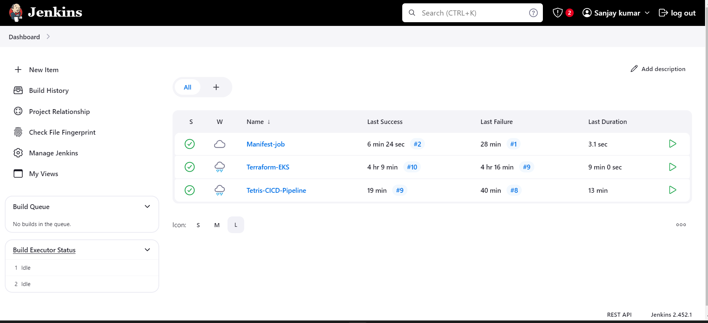
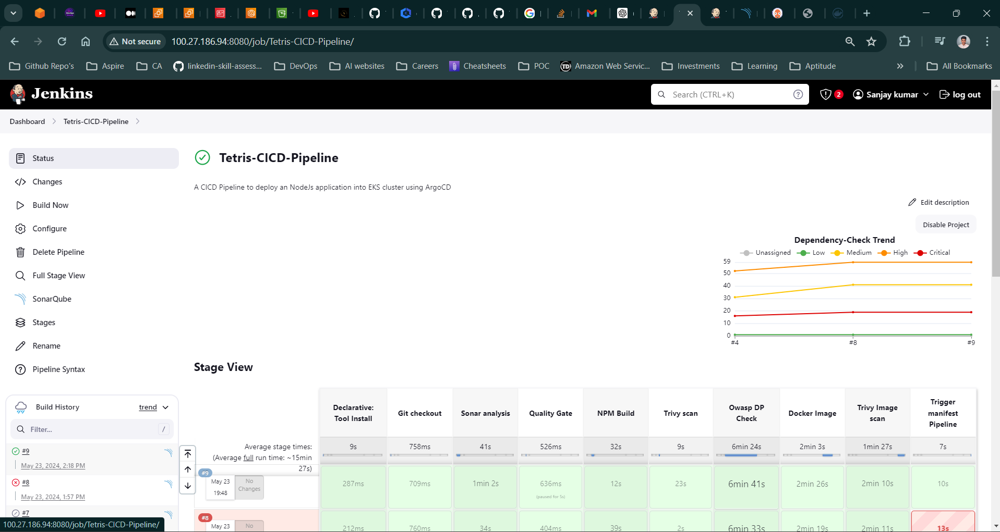
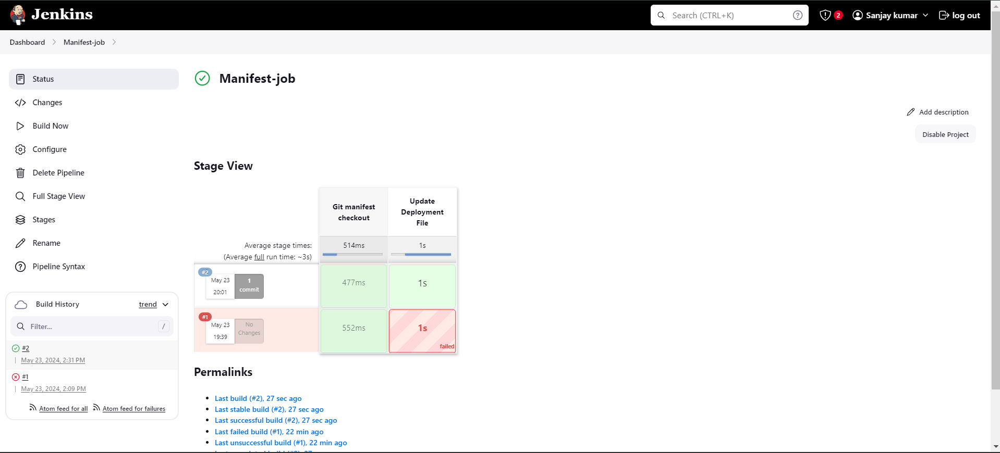
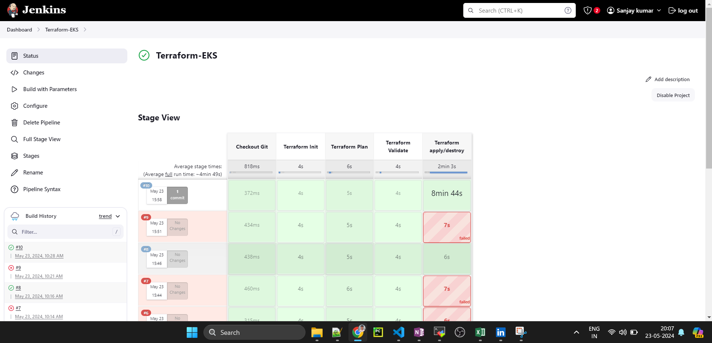

# Tetris-CICD-Jenkins
A Jenkins CICD Pipeline to Deploy the ReactJs application on EKS cluster using ArgoCD.

Tools used to deploy the application into the EKS cluster:

🔧 **Jenkins**: Serving as the heartbeat of our CI/CD pipeline, Jenkins orchestrates the automation of our software delivery, ensuring efficiency and reliability at every step.

📦 **GitHub**: Our trusted repository on GitHub, where collaboration thrives and code is version-controlled, enabling seamless teamwork and streamlined development workflows.

🔍 **SonarQube**: With SonarQube, we uphold the highest standards of code quality, conducting comprehensive code analysis to ensure our application meets industry best practices.

📦 **npm**: Leveraging npm for efficient package management within the Node.js ecosystem, simplifying dependency resolution and facilitating smooth development processes.

🔒 **OWASP Dependency Check & Trivy**: We prioritize security with OWASP Dependency Check and Trivy, scanning for vulnerabilities in our dependencies and Docker images to fortify our application against threats.

🐳 **Docker**: Containerizing our application with Docker ensures consistency and portability, allowing for seamless deployment across different environments and platforms.

🌟 **Amazon EKS**: Our application finds its home on Amazon Elastic Kubernetes Service (EKS), providing a scalable and resilient Kubernetes-based platform for hosting our containerized workloads.

🔄 **ArgoCD**: With ArgoCD, we embrace GitOps practices, automating the deployment of our applications to EKS based on Git repository changes, ensuring consistency and reliability.

# Refer the Jenkins file for pipeline script 

Some glimpses of the output:

Jenkin Job

# Manifest file update Pipeline

# EKS Cluster creation using Terraform script via Jenkins Pipeline

